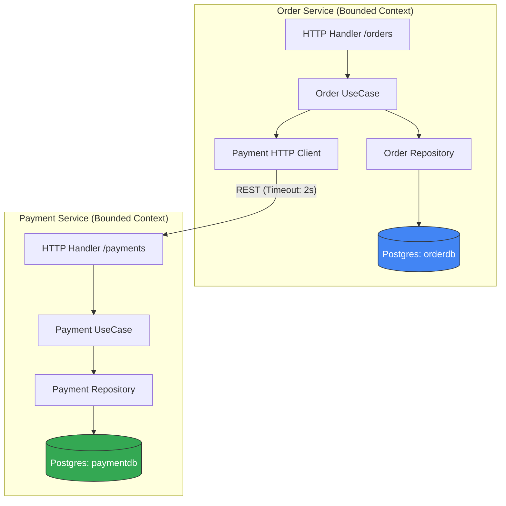

# 🚀 Order & Payment Microservices System (Go)

## 🏗️ Architecture & Bounded Contexts
[cite_start]This project implements a distributed system using **Clean Architecture** to ensure high maintainability and testability[cite: 15, 17].

### 🧩 Architecture Decisions
* [cite_start]**Separation of Concerns:** Each service is strictly layered into Domain, UseCase, Repository, and Transport[cite: 28, 41].
* [cite_start]**Dependency Inversion:** Use cases depend on interfaces (Ports), not implementations[cite: 35].
* [cite_start]**Manual DI:** All dependencies are wired in `main.go` (Composition Root) for full control[cite: 40].
* **Data Isolation:** Strictly **No Shared Database**. [cite_start]Each service has its own schema[cite: 37, 109].
* [cite_start]**No Shared Code:** Domain models are independent; we do not use "common" or "shared" packages[cite: 38, 117].

---

## ⚙️ Core Business Rules

### 💰 Financial Accuracy
* [cite_start]All monetary values use `int64` (cents/tiyn) to avoid floating-point precision issues[cite: 63, 93].

### 💳 Payment Logic
* [cite_start]**Limit:** Any amount exceeding **100,000** (1000 units) is automatically **Declined**[cite: 99].
* [cite_start]**Response:** Authorized payments return a unique `transaction_id`[cite: 90].

### 🛒 Order Lifecycle
* [cite_start]**Amount:** Must be **> 0**[cite: 95].
* [cite_start]**Invariants:** Once an order is marked as **"Paid"**, it cannot be **"Cancelled"**[cite: 86, 96].

---

## ⚠️ Failure Handling (Resilience)
[cite_start]Following the assignment requirements for robust inter-service communication[cite: 102]:

1.  [cite_start]**Custom HTTP Client:** The Order Service uses a client with a strict **2-second timeout**[cite: 101].
2.  **Service Unavailability:** If the Payment Service is down or slow:
    * [cite_start]The Order Service returns `503 Service Unavailable`[cite: 105].
    * [cite_start]The Order status remains `Pending` or is marked `Failed` to prevent hanging[cite: 106].

---

## 📌 API Endpoints

### 🛒 Order Service (`:8080`)
| Method | Endpoint | Payload | Logic |
|------|--------|--------|-------|
| **POST** | `/orders` | `{"customer_id": "str", ...}` | [cite_start]Creates order & calls Payment Service [cite: 75, 81] |
| **GET** | `/orders/{id}` | - | [cite_start]Retrieves details from DB [cite: 84] |
| **PATCH** | `/orders/{id}/cancel`| - | [cite_start]Cancels "Pending" orders only [cite: 85] |

### 💳 Payment Service (`:8081`)
| Method | Endpoint | Payload | Logic |
|------|--------|--------|-------|
| **POST** | `/payments` | `{"order_id": "str", ...}` | [cite_start]Authorizes and stores transaction [cite: 88, 90] |
| **GET** | `/payments/{order_id}`| - | [cite_start]Returns status for a specific order [cite: 91] |

---

## 🌟 Bonus Features
* [cite_start]**Idempotency:** Implementation of `Idempotency-Key` header to prevent duplicate orders/payments[cite: 123].
* **UUIDs:** Used for all primary keys to ensure unique identification across services.

---

## 🛠️ Setup & Deliverables
1.  [cite_start]**Migrations:** SQL scripts for both databases are in `/migrations`[cite: 53, 127].
2.  **Build:** Run `go run cmd/order/main.go` and `go run cmd/payment/main.go`.
3.  [cite_start]**Submission:** Source code, Diagram, and README provided as per criteria[cite: 124, 128].

---