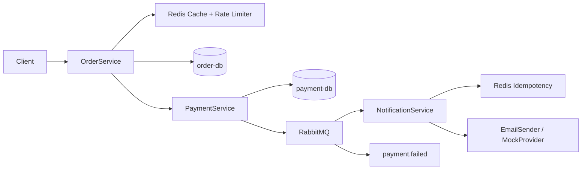

# README.md

# Order-Payment Microservices System (Assignment 3)

## Overview

This project implements a microservices-based system using **REST, gRPC, and event-driven architecture**.

The system processes orders, handles payments, and sends notifications asynchronously using **RabbitMQ**.

---

## Architecture

```text
Client (curl / API)
↓
Order Service (REST)
↓
Payment Service (gRPC)
↓
PostgreSQL (payments)
↓
RabbitMQ (event broker)
↓
Notification Service (Consumer)
```

Additionally:

```text
Failed messages → Dead Letter Queue (payment.failed)
```

---

## Architecture Diagram



Processed event IDs are stored in Redis for 24 hours.

This guarantees idempotency even after container restarts or multiple service replicas.

## Services

### 1. Order Service
- REST API (`/orders`)
- Handles idempotent order creation
- Calls Payment Service via gRPC

---

### 2. Payment Service
- Processes payments
- Stores results in PostgreSQL
- Publishes events to RabbitMQ after successful DB commit

---

### 3. Notification Service
- Consumes messages from `payment.completed`
- Simulates sending email notifications
- Uses manual acknowledgment
- Implements idempotency and DLQ handling

---

### 4. RabbitMQ
- Message broker
- Queue: `payment.completed`
- Dead Letter Queue: `payment.failed`

---

### 5. Databases
- PostgreSQL (order-db)
- PostgreSQL (payment-db)

---

## Cache Invalidation Strategy

The Order Service implements the cache-aside pattern using Redis.

Flow:

1. GET /orders/:id first checks Redis.
2. If cache exists, the order is returned immediately.
3. On cache miss, data is loaded from PostgreSQL and cached for 5 minutes.

When an order status changes (PAID, FAILED, CANCELLED), the Redis key is deleted immediately.

This prevents stale data such as returning PENDING for already paid orders.

## Retry Strategy

The Notification Service retries failed provider calls using exponential backoff:

- Retry 1 → 2 seconds
- Retry 2 → 4 seconds
- Retry 3 → 8 seconds

If all retries fail, the message is sent to the Dead Letter Queue.

## Bonus: API Rate Limiting

The Order Service uses Redis-based rate limiting.

Each client IP has its own Redis counter.

Policy:

- Maximum 10 requests per minute

If the limit is exceeded, the service returns:

HTTP 429 Too Many Requests

## Technologies

- Go (Golang)
- REST (Gin)
- gRPC
- RabbitMQ
- PostgreSQL
- Docker & Docker Compose

---

## How to Run

```bash
docker compose up --build
```

All services will start automatically:

* order-service → localhost:8081
* payment-service → gRPC
* notification-service → background consumer
* RabbitMQ UI → [http://localhost:15672](http://localhost:15672)

Login:

```text
guest / guest
```

---

## Testing

### Create Order

```bash
curl -X POST http://localhost:8081/orders \
-H "Content-Type: application/json" \
-H "Idempotency-Key: test123" \
-d '{
  "customer_id": "123",
  "item_name": "Coffee",
  "amount": 5000
}'
```

---

## Idempotency

* Implemented in **Order Service** using `Idempotency-Key`
* Prevents duplicate order creation

Example:

* Same key → same response
* No duplicate processing

---

## Event Flow

1. Order is created
2. Payment is processed
3. Event is published to RabbitMQ
4. Notification service consumes event
5. Email is simulated via logs

---

## Sample Notification Log

```text
[Notification] Sent email to test@example.com for Order #abc123. Amount: $5000.00
```

---

## Reliability Features

### At-least-once delivery

* Manual ACK (`autoAck = false`)
* Messages re-delivered if consumer crashes

---

### Durable Queues

* Messages survive RabbitMQ restart

---

### Idempotency

* Event IDs tracked in Notification Service
* Duplicate messages ignored

---

### Dead Letter Queue (DLQ)

* Failed messages sent to `payment.failed`
* Example trigger:

```text
customer_email = fail@example.com
```

---

### Graceful Shutdown

* Uses `os/signal`
* Stops consumer safely
* Processes pending messages before exit

---

## Idempotency & ACK Strategy

### Idempotency

The system ensures idempotency at two levels:

- **Order Service:** Uses an `Idempotency-Key` to prevent duplicate order creation.
- **Notification Service:** Uses a unique `event_id` for each message and stores processed IDs in memory to avoid duplicate processing.

If the same message is received again, it is ignored and not processed twice.

---

### ACK Logic

The Notification Service uses **manual acknowledgment (ACK)**:

- `autoAck` is disabled.
- A message is acknowledged only after successful processing (after logging the notification).
- If the service crashes before ACK, the message is re-delivered by RabbitMQ.

This ensures **at-least-once delivery** and prevents message loss.

---

## Design Principles

### ✔ Separation of Concerns

* Messaging logic abstracted via interface
* UseCase layer independent from RabbitMQ

---

### ✔ Decoupled Services

* Notification Service does NOT call other services
* Communication via events only

---

### ✔ Event-Driven Architecture

* Loose coupling between services
* Better scalability and reliability

---

## Limitations

* Idempotency uses in-memory storage (lost after restart)
* In production, should use Redis or persistent DB

---

## Conclusion

This project demonstrates:

* Microservices architecture
* gRPC communication
* Event-driven design
* Reliable message processing using RabbitMQ
* Production-ready patterns (ACK, DLQ, idempotency)

---

## Author

Nuraly Nuray, SE-2416
AITU Software Engineering Student