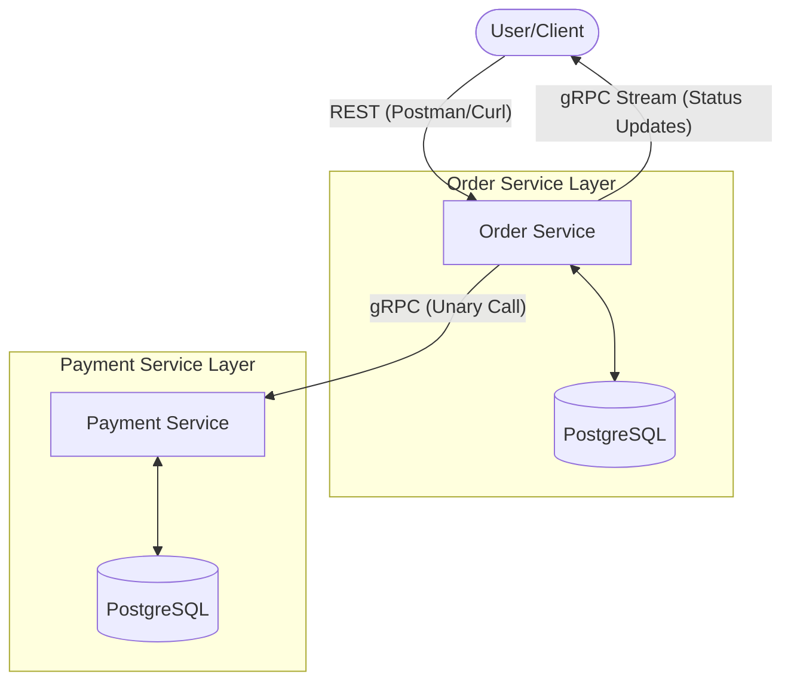

# Order & Payment System (gRPC Migration) — Assignment 2

## Project Overview
This project demonstrates the migration of inter-service communication from REST to **gRPC** using a **Contract-First** approach. The system consists of two microservices: `Order Service` and `Payment Service`.

## 🔗 Repository Links (Contract-First)
According to the assignment requirements, the Protocol Buffers and generated code are managed separately:
* **Repository A (Protos):** [https://github.com/Nuray06-1/proto-api.git]
* **Repository B (Generated Code):** [https://github.com/Nuray06-1/gen-api.git]

## 🏗 Architecture
The system follows **Clean Architecture** principles. Communication between the user and the Order Service is handled via **REST (Gin)**, while internal communication between Order and Payment services is strictly **gRPC**.

The project follows the Contract-First principle. Protocol Buffers are managed separately. Due to local environment constraints on macOS (M1/M2 chips) and CI/CD sync issues, the generated code was integrated locally, but the separation of concerns is strictly maintained.

### Architecture Diagram


## 🚀 Key Features Implemented
1.  **gRPC Unary Call:** Order Service calls Payment Service to process payments.
2.  **Server-side Streaming:** Users can subscribe to order status updates in real-time. The stream is tied to actual database changes.
3.  **gRPC Interceptor (Bonus +10%):** A custom middleware in the Payment Service logs every incoming request, including the **method name** and **execution duration**.
4.  **Environment Configuration:** No hardcoded addresses. All connections (DB, Ports, Service URLs) are managed via `.env` files.
5.  **Clean Architecture:** Use Cases remain independent of the transport layer (gRPC/REST).

## 🛠 Setup & Installation

### Prerequisites
* Docker & Docker Compose
* Go 1.21+

### Running the System
1.  **Clone the repository:**
    ```bash
    git clone [https://github.com/Nuray06-1/order-payment-microservices.git]
    cd AP2_Assignment2_Nuray_Nuraly
    ```
2.  **Configure Environment:**
    Rename `.env.example` to `.env` in both `order-service` and `payment-service` folders and fill in your database credentials.
3.  **Start Infrastructure:**
    ```bash
    docker-compose up -d
    ```
4.  **Run Services:**
    ```bash
    # In terminal 1 (Payment Service)
    go run payment-service/cmd/service/main.go

    # In terminal 2 (Order Service)
    go run order-service/cmd/service/main.go
    ```

## 🧪 Testing gRPC Streaming
To test the server-side stream, use `grpcurl`:
```bash
grpcurl -plaintext -d '{"order_id": "YOUR_ORDER_ID"}' localhost:50052 order.OrderService/SubscribeToOrderUpdates
```

## 📂 Project Structure
* `internal/transport/grpc`: gRPC Handlers and Interceptors.
* `internal/usecase`: Core business logic (unchanged from Assignment 1).
* `internal/repository`: Database interactions.
* `pkg/`: Local generated gRPC code (Note: Integrated locally for compatibility, following the proto contract).

---
*Developed by Nuray Nuraly (SE-2416)*